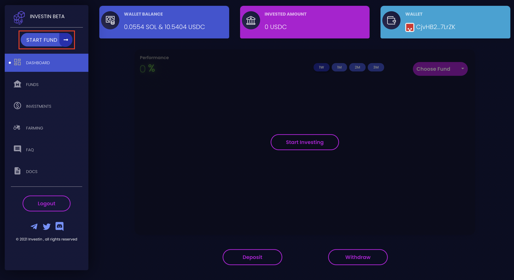
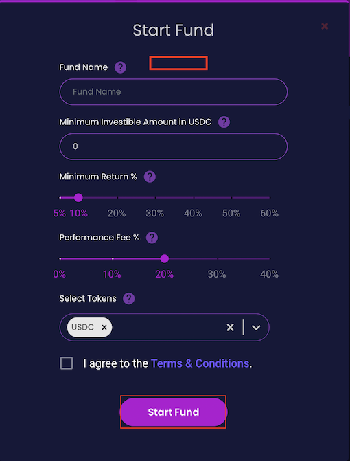

# Market making funds

Here, we provide a step-by-step guide on to create a market making fund and connect it to a bot running on google cloud

1. Create fund and set an delegate address for sending instructions
2. Clone basic market making bot repo
3. Set the bot on cloud and add in delegate private keys
4. Check the positions through manager dashboard and claim performance fee i.e $MNGO tokens 

### Create fund 
* Visit [Investin][1] dashboard and click on start fund
[1]:https://sol.beta.investin.pro/user/dashboard

{: align=center }

* Select market making from type of fund selection and click on create fund
* These funds will have a fixed 2% management fee collected on deposits and 20% performance fee collected from $MNGO tokens earned through market making.

    {: width="300" align=center }

* Set the delegate address whose private key you will be adding in bot configuration

<figure>
  
  <!-- <figcaption>Image caption</figcaption> -->
</figure>

* Visit github and clone the repository on your computer

* To run locally follow the readme instructions in the repository

* To run on the cloud create a account on GCP and add private keys of your delegate in config.json