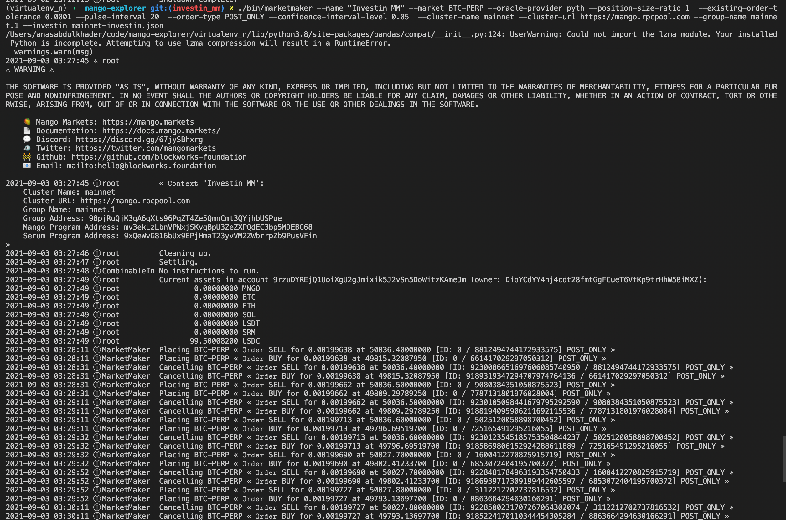

# Market making funds


Here, we provide a step-by-step guide to create a market making fund and connect it to a bot running locally or on the cloud.

Basic requirements:

* Python v3.8
* pip v20 

Steps:

1. Create fund and set an delegate address for sending instructions
2. Invest USDC in fund and have some SOL in delegate address
2. Clone basic market making bot [repo][2]
[2]:https://github.com/Investin-pro/mango-explorer.git
3. Set the bot on cloud and add in delegate address private keys
4. Check the positions through manager dashboard and claim performance fee i.e $MNGO tokens 


### Create fund 
* Visit [Investin][1] dashboard and click on start fund
[1]:https://sol.beta.investin.pro/user/dashboard

{: align=center }

* Select market making from type of fund selection and Add minimum deposit, performance fee % i.e. `(Share of $mngo accrued which goes to the manager as performance reward)`and manager would earn the usual performance fees if the fund performance goes above the minimum return percentage.
                
  ___________________________{: width="300" align=center }________________________


* After the fund is created, create a new wallet and set it as the delegate address using the manager dashboard (you can also use manager address with which fund was created)
* Fund the newly created address with $sol 
### Basic market making bot
* Clone repo: https://github.com/Investin-pro/mango-explorer.git
* Click open config button on dashboard page, copy it and paste in the cloned repo to the file: mainnet-investin.json
* In the cloned repo terminal run the following commands and paste the private keys of delegate address or manager address.
    ```yaml
    touch id.json
    cat > id.json 
    enter "your private key"   
    press ctrl+D


    ```

* Setup the marketmaking bot in a python virtualenv:

    ```yaml
    pip install virtualenv
    virtualenv venv
    virtualenv -p /usr/bin/python3 venv
    source venv/bin/activate 
    pip install -r requirements.txt
    ```

* Run the marketmaking bot
      ```yaml
      ./bin/marketmaker --name "Investin MM" --market BTC-PERP --oracle-provider pyth --position-size-ratio 0.2  
      --existing-order-tolerance 0.0001 --pulse-interval 5 --order-type POST_ONLY --confidence-interval-level 0.05  --cluster-name 
      mainnet --cluster-url https://mango.rpcpool.com --group-name mainnet.1 --investin investin.json 
      ```

* If everything goes well you will see something like this on terminal 

{: align=center }


Have any doubts or stuck at any step please join our [discord][4] for assitance
[4]:https://discord.gg/jk9bmbwh74