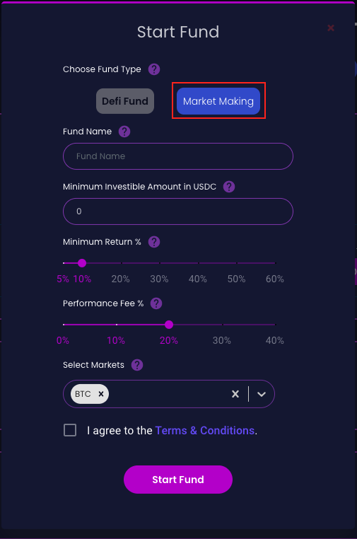
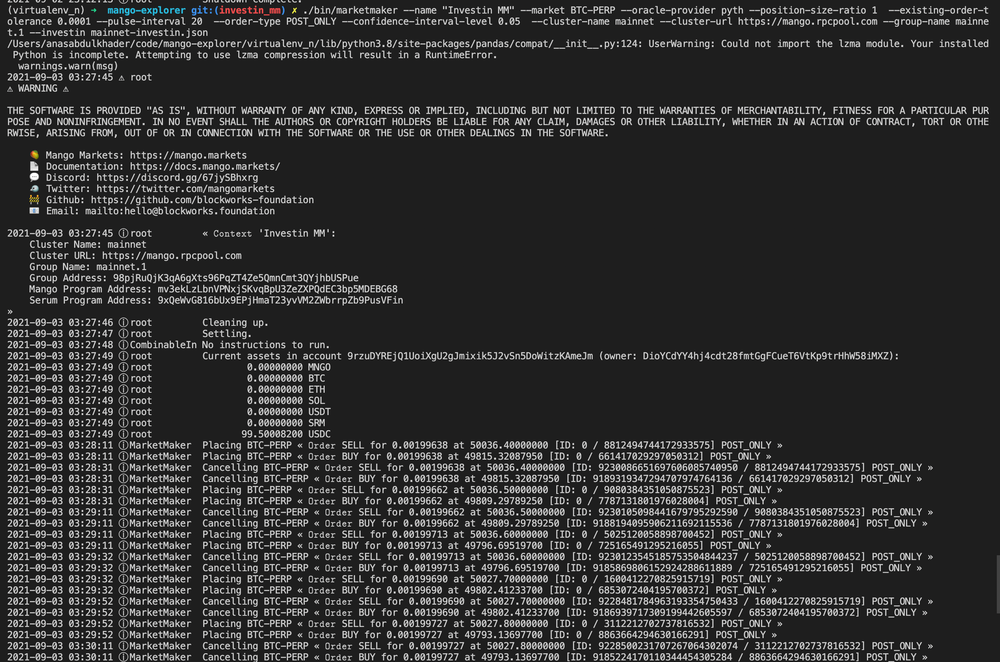

# Market making funds


Here, we provide a step-by-step guide to create a market making fund and connect it to a bot running locally or on the cloud.

Basic requirements:

* Python v3.8
* pip v20 

Steps:

1. Create fund and set an delegate address for sending instructions
2. Invest USDC in fund and have some SOL in delegate address
2. Clone basic market making bot [repo][2]
[2]:https://github.com/Investin-pro/mango-explorer/tree/investin_mm
3. Set the bot on cloud and add in delegate address private keys
4. Check the positions through manager dashboard and claim performance fee i.e $MNGO tokens 


### Create fund 
* Visit [Investin][1] dashboard and click on start fund
[1]:https://qa.sol.investin.pro/user/dashboard

{: align=center }

* Select market making from type of fund selection and Add minimum deposit, performance fee % i.e. `(Share of $mngo accrued which goes to the manager as performance reward)`and manager would earn the usual performance fees if the fund performance goes above the minimum return percentage.

* Select the perp market, currently we have BTC-PERP & SOL-PERP
                
  ___________________________{: width="300" align=center }________________________


* After the fund is created, create a new wallet and set it as the delegate address using the manager dashboard (you can also use manager address with which fund was created)
* Fund the newly created address with $sol 
### Basic market making bot
* Clone repo: https://github.com/Investin-pro/mango-explorer/tree/investin_mm
* git checkout sol-perp
* Click open config button on dashboard page, copy it and paste in the cloned repo to the file: mainnet-investin.json
* In the cloned repo terminal run the following commands and paste the private keys of delegate address or manager address. The private key should look something like this 
    
    ```yaml
    [110,49,211,169,16,1,52,50,225,133,73,175,67,185,69,124,79,194,153,3,53,41,204,180,255,80,44,140,43,222,6,53,13,114,16,218,159,70,85,72,57,243,132,149,4,117,23,61,10,101,43,62,61,1,216,197,55,59,237,8,106,171,135,60]
    ```
    
    
    
    ```yaml
    touch id.json
    cat > id.json 
    enter "your private key"   
    press ctrl+D


    ```

* Setup the marketmaking bot in a python virtualenv:

    ```yaml
    pip install virtualenv
    virtualenv venv
    virtualenv -p /usr/bin/python3 venv
    source venv/bin/activate 
    pip install -r requirements.txt
    make sure to check python location by using (which python) and put that in place of /usr/bin/python3
    sudo ln -s /usr/bin/python3 /usr/bin/pyston3
    ```
    

* To run the marketmaking bot
      ```yaml
      ./bin/marketmaker --name "Investin MM" --market SOL-PERP --oracle-provider pyth  --existing-order-tolerance 0.0001 --pulse-interval 10 --order-type POST_ONLY --chain ratios --ratios-spread 0.006 --chain fixedpositionsize --fixedpositionsize-value 0.2  --cluster-name mainnet --cluster-url https://solana-api.projectserum.com --group-name mainnet.1 --id-file id.json --investin mainnet-investin.json 

      ```

* If the fund was created for btc-perp make sure to change the --market BTC-PERP and for sol-perp to SOL-PERP


* If everything goes well you will see something like this on terminal 

{: align=center }


###APY 
To estimate the APY for mango rewards earned by market making fund over a time period we use the following formula:

$$
(mngoPerShare[T] - mngoPerShare[T-12])*mngoPrice*100*2*365
$$ 

* T = time period


###Performance Fee
The performance fee is collected on all the mango rewards accured by market making and is set by manager on fund creation. The same percentage is also used to collect performance fee if the USDC evaluation of fund goes above the minimum return percentage.


Have any doubts or stuck at any step please join our [discord][4] for assitance
[4]:https://discord.gg/jk9bmbwh74