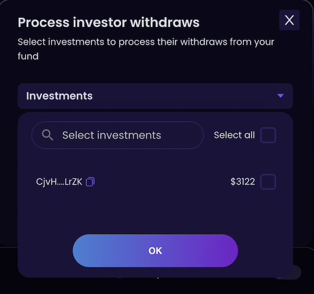

# 🥭 Mango based funds

Mango based funds allow pooling of investments that can be traded through an delegate address on [Mango.markets][1]. Fund managers can manage the investments by interacting with Mango UI or program and experience full fledged margin/perp trading with all bells & whistles on Mango using the pooled funds. Accounting is handled by Investin contracts which allow timely withdrawals in two way i.e soft withdrawals and hard withdrawals.  

### Create fund 
* Visit [Investin][5] to start fund and make sure to select Mango based fund from type of fund selection
[1]:https://trade.mango.markets/?name=SOL-PERP
[5]: https://sol.beta.investin.pro/myFund

<figure markdown>
  { width="600" }
  <figcaption>Create fund model</figcaption>
</figure>

* Enter minimum deposit and performance fee %

* Intially the delegate address is set to fund manager's address and can be changed to the desired address
* After the fund is created and funded, fund manager's can visit [mango.markets][1] and connect their wallet to start managing assets invested through Investin (its that easy!)
## Accounting Mechanism

Having pioneered accounting system for handling non-custodial withdrawals with our flagship product defi hedge funds we reworked on withdrawal systems to allow full fledged trading on Mango and to make this possible we built two ways to handle withdrawals which are described in detail below: 

### 1. Soft withdrawals 

Soft withdrawals is a system where fund managers work with Investors to complete withdrawals as soon as possible. Firstly when an Investor wants to withdraw from a fund they can put a request for withdrawal using the Investments tab on Investin and this request will be made visible to fund manager and if they wish to settle it right away for the investor to exit from the fund they can do so by honoring the withdrawal request through Investin's UI.

<figure markdown>
  { width="300" }
  <figcaption>Withdrawal request tab for fund managers</figcaption>
</figure>

### 2. Hard withdrawals

Hard withdrawals happens every Friday 01:00 UTC in this process all pending withdrawal requests on fund will be processed by Investin without effecting health of margin account and all open orders will be closed and spot assets will be sold on market according to the pro rata share of all pending withdrawal requests. We expect fund managers to settle withdrawals using soft withdrawal method since this process will incur slippage and effect the perfromance of fund. 

###Performance Fee
The performance fee is collected on all the mango rewards accrued by market making and is set by manager on fund creation. The same percentage is also used to collect performance fee if the USDC evaluation of fund goes above the minimum return percentage.

Have any doubts or stuck at any step please join our [discord][4] for assistance
[4]:https://discord.gg/jk9bmbwh74
