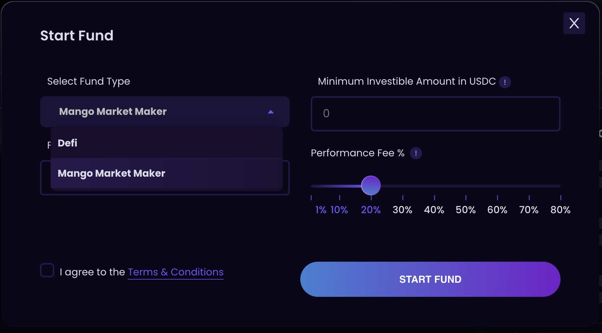

# 🥭 Mango based funds

Mango based funds allow pooling of investments that can be traded through a delegate address on [Mango.markets][1]. Fund managers can manage the investments by interacting with the Mango UI or program and experience full-fledged margin/perp trading with all the bells & whistles on Mango using the pooled funds. Accounting is handled by Investin contracts which allow timely withdrawals in two ways(soft withdrawals and hard withdrawals).  

### Create fund 
* Visit [Investin][5] to start fund and make sure to select Mango based fund from type of fund selection.
[1]:https://trade.mango.markets/?name=SOL-PERP
[5]: https://sol.beta.investin.pro/myFund

<figure markdown>
  { width="600" }
  <figcaption>Create fund model</figcaption>
</figure>

* Enter minimum deposit and performance fee %

* Initially the delegate address is set to fund manager's address but can be changed to another desired address.
 * After the fund is created and funded, Fund Managers can visit [mango.markets][1] and connect their wallet to start managing assets invested through Investin. It’s that easy!
 * There is a $50 Manager Lock-up amount each manager must deposit when initiating their fund. This is to handle any rounding errors that may occur (fractions of cents) during normal deposits and withdrawals. This $50 will be returned if the Fund is ever closed.
* You can always set a new address as an delegate to access the mango account using [mango.markets][1]
<figure markdown>
  { width="300" }
  <figcaption>Set delegate model</figcaption>
</figure>

!!! WARNING
Do not deposit into the fund using Mango's UI. Only use Investin to deposit into a fund.
## Accounting Mechanism

We have pioneered an accounting system for handling non-custodial withdrawals with our flagship product DeFi Hedge Funds. We reworked on the withdrawal systems to allow full-fledged trading on Mango. To make this possible we built two ways to handle withdrawals which are described in detail below: 

### 1. Soft Withdrawals 

A Soft Withdrawal is a process where Fund Managers work with Investors to complete withdrawals as soon as possible. When an Investor wants to withdraw from a fund, they can put a request for withdrawal using the Investments tab on Investin. This request will be made visible to the Fund Manager and if they wish to settle it right away for the investor to exit from the fund, they can do so by honoring the withdrawal request through Investin's UI.

<figure markdown>
  { width="300" }
  <figcaption>Withdrawal request tab for fund managers</figcaption>
</figure>

### 2. Hard Withdrawals

If a Fund Manager does not process the withdrawal request through the Soft Withdrawal process, then the Hard Withdrawal process will kick in. Hard Withdrawals happens every Friday 01:00 UTC. In this process all pending withdrawal requests on fund will be processed by Investin without affecting health of margin account. All open orders will be cancelled, then the adequeate perp positions will be market closed, and if needed spot assets will be market sold according to the pro rata share of all pending withdrawal requests while maintaining the same health factor across the fund. We expect Fund Managers to settle withdrawals using soft withdrawal method since this process will incur slippage and affect the performance of fund. 

If you have any doubts or are stuck at any step please join our [discord][4] for assistance.
[4]:https://discord.gg/jk9bmbwh74
