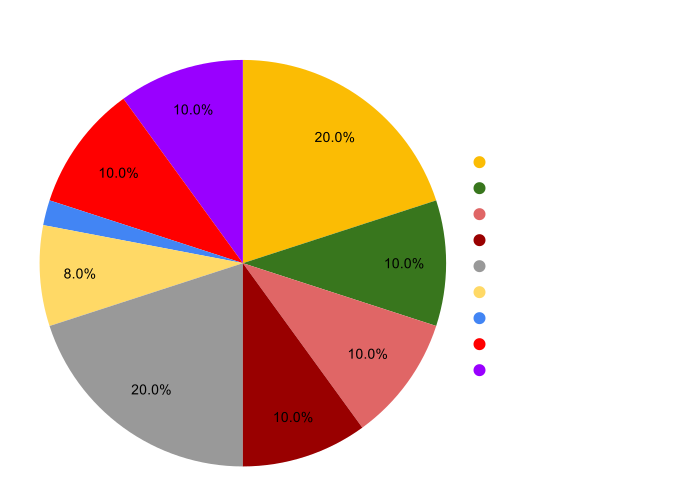

# Investin Token (IVN)

## Overview

{: align=right }

IVN is an ERC 20 token built on OpenZeppelin standards, its native token of the protocol which will be used both to capture value from the protocol and allow holders to participate in governance. Without users any protocol is worthless and IVN token represents ownership in the protocol and is architectured in a way that as the protocol's total value under management grows, further it will be owned by managers running funds on it.

 `Investin's most important stakeholders are its Managers/Traders`

Investin's growth is directly proportional to its user's success hence the tokeneconomics is deeply baked into making users the rightful owners of the protocol so that they can capture most value out of it.

The protocol captures an average `1.4%` of total value under management as a fee on each successful cycle of manager meeting their set return of investment and collecting performance fee. Hence manager's success in markets is directly proportional to the protocol's growth and to ensure the longevity of the relation, `the total fee accrued by the protocol will be distributed among the managers` and developers with a [gradual_decrease] [1] in developer share as fee earned by protocol increases to make sure both the parties move in a smooth linear growth. 
<!-- And as the growth accelerates there will be a tier-based reduction on fee distributed to developers and subsequent increment to the fee distributed to managers. -->
[1]: https://aak-capital.github.io/Investin_docs/token/#for-managerstraders
## Incentives 

The goal of any decentralize protocol is to ultimately give ownership to its users and incentivize them enough to align paths on producing maximum profitability for all parties involved.

## For managers/traders

Managers/traders running funds on investin and staking IVN tokens will capture the accured fee earned by staking IVN in staking contract which will mint `IVNx` tokens that represent their share in the fee distribution pool. 

`You will come with less IVN tokens only to leave with more.`

The fee distribution to manager pool will gradually increase on a tier-based system which is determined by the total value generated by Investin's managers.

| Protocol earnings| Managers Fee %|Developers Fee%| Fee used to burn tokens |
| ----------- | -------------- | -------------- | -------------- |
| 100k       | 50%|           50%      |  0% |
|   400k       | 55%|             42.5%  | 2.5% |
| 800k    | 59% |         36%         | 4% |
| 1.6m    | 62.2% |         31.7%         | 6.1% |
| 6.4m    | 64.76% |        27.86%         |7.38% |
| 25.6m    | 66.76% |        24.76%         |8.38% |

The dev team has decided to use 20% of profits accrued from developer fee% to buyback IVN tokens and burn to further align goals with protocol growth.
Incase the manager's don't stake to capture the total fee, the fee will be used to buyback IVN and burn. 
The burning will stop when 50% of tokens are burnt and in subsequent phase the fee would be added to managers earning pool.

Additional incentives are planned to be given to managers handling top performing funds, funds with high aum, funds with greater than 100 investors and much more...

## For Investors

Investin's key liquidity providers are expected to actively engage with protocol to find the best performing fund for their investment. 
<!-- and get a 50% reduction on holding IVN token in their wallet while they are invested in Investin funds.
The ivn holdings to get 50% fee reduction in management fee is elaborated below. The investors are expected to increase their ivn holdings to get the same benefits at each increment in fee captured by the protocol.

| Fees captured| IVN holding |
| ----------- | -------------- | 
| 100k       | 100|         
|   200k       | 200|      
| 800k    | 400 |         
| 1m    | 800 |        
| 2m    | 1200 |         -->

The investors will be airdropped IVN for certain criteria's and in a highly unlike scenario where fund's hit maximum drawdown due to technical breakdown investors can expect the losses to be covered by the treasury which is locked to safeguard investin's key liquidity providers interests.
10% of IVN are locked as insurance for investor funds and as the total value under management grows this treasury will be replenished with a basket of different assets to protect all user's interests. 

## IVN allocation and sales 

A total supply of 9,000,000 IVN tokens are minted with no further minting possible as the contract has no minting functionality. 

{: align=center }

A total of 20% of tokens will be sold on binance smart chain and 10% will be used to add liquidity to AMM, since we dont have a significant backing we will be providing liquiidty for a indefinite time. We would be announcing more details on liquidity farming intiatives for protocol users soon.

* The token sale is priced at 1 BNB = 2400 IVN. 
* The seed was raised at 0.12 USD per token and is vested over 3 years with a 8% scheduled release every quarter
* Core team's tokens are vested for 3 years with 8% scheduled release every quarter.
* The advisory tokens are unallocated at the moment and once advisors are onboarded the tokens would be vested for 1 year.

The treasury is used to incentivize users and make them part owners of Investin, there will be scheduled airdrops to top performing funds, funds managing high aum consistently and to investors committed to building investin. 
In rare cases when a [white-listed][2] token gets hacked and fund performance crashes, the treasury will be used to compensate investor losses as it's investin's job to maintain rug proof tokens white listed that funds can trade on.
[2]: https://investin-pro.github.io/Investin_docs/manager/#trading-pairs

### Fund usage 

* 50% of the funds will be used to build the Investin protocol and perform upgrades to the existing architecture/UI, which includes team recruits and R&D on layer 2 solutions.
* 35% will be used to perform security upgrades and bug bounties. Investin being fund management protocol have to put fund security as its top priority.
* 15% will be kept in reserve to cope with any emergency or unexpected situations 

## Governance 

We believe alignment between token holders and protocol stakeholders is crucial for successful decentralized governance. More explicitly, we believe IVN tokens are the vehicle to drive alignment and participation in the protocol. IVN token holders should be people who interact with the protocol in some way, are committed to its future development, and want a seat at the governance table.

We expect token holders to help guide the protocol to its fullest potential through experimentation and active participation. For example, implementing new functionality, introducing changes to protocol level fee, etc. Anything contentious will certainly go to the IVN token holders for review.

## Deepdive economics

### Deflationary value explained 
adding soon