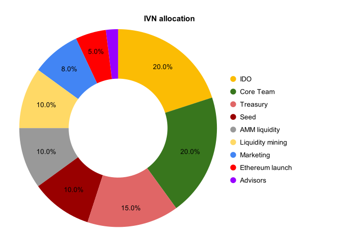

# Investin Token (IVN)

## Overview

{: align=right }

IVN is the native token of the protocol which allows its holders to capture value from the protocol, unlock pro features, and participate in governance. IVN token represents ownership of the protocol and is designed to incentivize Managers to run their funds and attract investments. 
 `Investin's most important stakeholders are its Managers/Traders`

Investin's growth is directly proportional to its user's success hence the tokeneconomics are deeply baked into making them the rightful owners of the protocol.

The protocol captures an average `1.4%` value of the total assets under management in fees on each successful cycle of A Manager meeting their set returns on investments. Hence, the Manager's success in the markets is directly proportional to the protocol's growth and to ensure the longevity of the relationship, `the total fee accrued by the protocol will be distributed among the managers who stake their IVN tokens.` 
<!-- As protocol growth accelerates there will be a tier-based reduction on fee distributed to developers and subsequent increment to the fee distributed to managers. -->
[1]: https://aak-capital.github.io/Investin_docs/token/#for-managerstraders
## Incentives for fund managers

The goal of any decentralized protocol is to ultimately give ownership to its users. IVN Tokens will be used to incentivise fund managers who outperform their peers through our Performance Mining program. Managers who stay on top of the leaderboard across sucessive intervals will be eligible to earn IVN rewards which are used to unlock additional pro features and also earn an additonal share of the protocol fees.

### Fee Distribution 

Managers running funds on Investin and staking IVN tokens will capture a share of the accured protocol fee by staking IVN tokens in staking contract controlling the fee distribution pool. 

`Make sure you stack enough IVN tokens to capture a bigger share!`

Unclaimed shares of the Protocol fee from unstaked supply will be used to buyback IVN and burn it. 
The burning will stop when 50% of tokens are burnt and in subsequent phases the fee would be added to top performing funds as additional returns.

<!-- The fee distribution to manager pool will gradually increase on a tier-based system determined by the total value generated by Investin's Managers. -->

### Performance Mining

Managers that top the leaderboards are rewarded through a performance mining program. A definite number of IVN tokens will be distributed everyday to encourage managers to maintain their performance and also attract more traders to start funds bringing in more users to the protocol. The mining rewards are distributed based on the following scoring system: 

$$
Score(fund) = (\frac{Perf_{fund}}{Perf_{max}}W_{perf}) + (\frac{AUM_{fund}}{AUM_{max}}W_{aum}) + (\frac{Nol_{fund}}{Nol_{fund}}W_{nol})
$$ 

<!-- * Perf~max~ : Highest fund performance relative to last epoch    -->
<!-- * AUM~max~ : Highest AUM of fund -->
<!-- * Nol~max~ : Highest number of investor over all funds -->

|   Performance  |         Assets under management                |     Number of investors  | 
|  |  |    |
|Perf~max~ : highest fund performance relative to last epoch|AUM~max~ : highest AUM of fund |Nol~max~ : highest number of investor over all funds| 
|Perf~fund~ : fund performance relative to last epoch|AUM~fund~ : current AUM of the fund |Nol~fund~ : current number of investors in the fund|
|W~perf~: weightage assigned to performance   |W~aum~: weightage assigned to AUM|W~nol~: weightage assigned to number of investors | 
|$$ W_{perf}: 60 points $$  | $$ W_{aum}: 30 points $$| $$ W_{nol}: 10 points $$ |

As shown above, the score is a weighted average of the three charecterisitc metrics of each fund, normalised over the curent epoch with the following weightage: `Performance: 60%, AUM: 30%, and Number of investors: 10%`. Fund Managers qualifying witha score greater than the minimum threshold will be airdropped their respecttive IVN rewards at the end of each epoch (lasting 7 days) and the scores will be reset for the next epoch. 

<!-- | Protocol earnings| Managers Fee %|Developers Fee%| Fee used to burn tokens |
| ----------- | -------------- | -------------- | -------------- |
| 100k       | 50%|           50%      |  0% |
|   400k       | 55%|             42.5%  | 2.5% |
| 800k    | 59% |         36%         | 4% |
| 1.6m    | 62.2% |         31.7%         | 6.1% |
| 6.4m    | 64.76% |        27.86%         |7.38% |
| 25.6m    | 66.76% |        24.76%         |8.38% |

The core dev team has decided to use 20% of profits accrued from developer fee% to buyback IVN tokens and burn to further align goals with protocol growth. -->

<!-- Additional incentives are planned to be given to Managers handling top performing funds, Funds with high AUM, Funds with greater than 100 investors and much more... -->

## For Investors

Investors are expected to actively engage with protocol to find the best performing fund for their investments. 

<!-- IVN holders receive a 50% fee reduction in the management fee as elaborated below. The Investors can increase their IVN holdings to receive the same benefits as each increment in fee captured by the protocol.

| Fees captured| IVN holding |
| ----------- | -------------- | 
| 100k       | 100|         
|   200k       | 200|      
| 800k    | 400 |         
| 1m    | 800 |        
| 2m    | 1200 |         -->

Investors will be airdropped IVN based on various criterias as the protocol matures and in a highly unlikely scenario where a fund experiences an unexpected drawdown due to a technical breakdown on Investin's side. Investors can expect their losses to be covered by the treasury safeguarding Investin's capital providers' interests.
10% of IVN tokens are locked as insurance in the treasury vault and as the total value under management grows this treasury will be replenished with a basket of different assets to protect all user's interests. 

## Token Utility 

IVN tokens locked in the staking contract will allow fund managers to unlock pro features and earn a proportional share of the protocol fee. Following is a list of pro features that will be available for managers to use:

* Limit/stoploss orders
* Access greater than 2x leverage on margin accounts
* Access to governance portal to vote and submit proposals

<!-- Investor stoploss system needs a liquidation engine to close positions on behalf on Investors at set percentages defined by Investors, a fixed fee of 1% of total assets will be awarded to liquidiators and  -->
## IVN allocation and sales 

A total supply of 9,000,000 IVN tokens are minted with no further minting possible as the contract has no minting functionality. 

{: align=center }

Initial Liquidty for IVN tokens was sourced from the IDO ([Wault IDO][4]) and we have remained the major liquidity provider for IVN pools ever since.

* The project was bootstrapped by the founders, hence the seed tokens remain unallocated. 
* Tokens allocated to the core team are vested linearly for 3 years with a quarterly release schedule. [contract address][6]
* Half of the tokens allocated for Liquidity Mining were used to incentivize the native IVN LP Farming and the rest will be utilized in future LP farming programs. 
* The advisory tokens are unallocated at the moment and once advisors are onboarded the tokens will be vested for period of 1 year.

The treasury is used to incentivize users and make them part owners of Investin. There will be scheduled airdrops to top performing Funds, Funds managing a high AUM consistently, and to Investors committed to helping Investin grow. 
In rare cases when a [white-listed][2] token pool gets manipulated and fund performance crashes, the treasury will be used to compensate investor losses as it's imperative for the protocol to maintain a rug-proof token white list that funds can trade with.
[2]: https://investin-pro.github.io/Investin_docs/manager/#trading-pairs
[3]: https://bscscan.com/tx/0xb7ef325b3c544a7c31ca18409dfdcccf00647d482959aa11876ede2667196f80
[4]: https://medium.com/waultfinance/announcing-another-launchpad-presale-investin-pro-42cef4bfac24
[6]: https://solscan.io/account/6y4AFVa8aaZGirYi16ex5hwDjgdHsg9GfdUwUQ93Q6sr

### Fund usage 

* 50% of the funds will be used to build the Investin protocol and perform upgrades to the existing architecture/UI which includes team recruits and R&D on future integrations.
* 35% will be used to perform security upgrades and offer bug bounties. Investin being an asset management protocol puts fund security as its top priority.
* 15% will be kept in reserve to cope with any emergency or unexpected situations 

## Governance 

We believe alignment between token holders and protocol stakeholders is crucial for successful decentralized governance. More explicitly, we believe IVN tokens are the vehicle to drive alignment and participation in the protocol. IVN token holders should be people who interact with the protocol in some way, are committed to its future development, and want a seat at the governance table.

We expect token holders to help guide the protocol to its fullest potential through experimentation and active participation. For example, implementing new functionality, introducing changes to protocol level fee, etc. Anything contentious will certainly go to the IVN token holders for review.

## Deepdive economics

### Deflationary value explained 
adding soon
