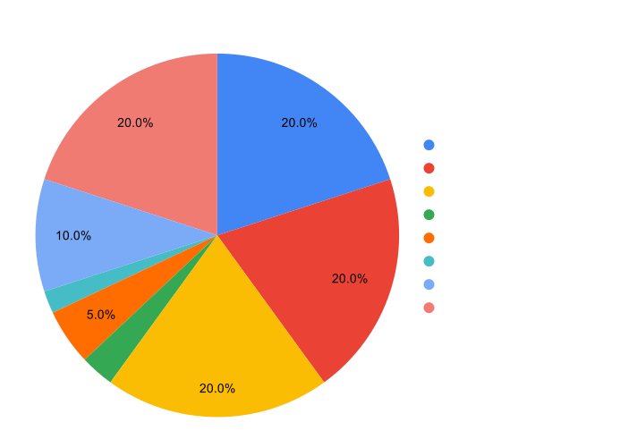

# Investin Token (IVN)

## Overview

{: align=right }

IVN is an ERC 20 token built on openzepplin standards, its native token of the protocol which will be used both to capture value from the protocol and allow holders to participate in governance. Without users any protocol is worthless and IVN token represents ownership in the protocol and is architecured in a way that as the protocol's total value under management grows the further it will be owned by managers running funds on it.

 `Investin's most important stake holders are its Managers/Traders`

Investin's growth is directly proportional to its users success hence the tokeconomics is deeply baked into making users the rightful owners of protocol so that they can capture most value out of it.

The protocol captures on an average `1.4%` of total value under management as fee on each successful cycle of manager meeting their set return of investment and collecting performance fee. Hence manager's success in markets is directly proportional to protocol's growth and to insure the longevity of the relation, 50% of total fee accured by the protocol will be distributed among the managers based on meeting the minimum [criteria][1] and rest 50% to development team to make sure both the parties move in a smooth linear growth. 
And as the growth accelerates there will be a tier based reduction on fee distributed to developers and subsequent increment to the fee distributed to managers.
[1]: https://pages.github.com/
## Incentives 

The goal of any decentralize protocol is to ultimately give ownership to its users and incentivize them enough to align paths on achieveing maximum profitibilty for all parties involved.

## For managers/traders

Managers/traders running funds on investin and staking IVN tokens will capture the 50% fee as elloborated below: 

| Tokens staked      | Fee captured                          |
| :---------: | :----------------------------------: |
| 100       | 20%   |
    | 200       | 40% |
    | 400    | 60% |
    | 800    | 80% |
    | 1000    | 100% |

The managers should increase their staked tokens as the total fee collected by protocol increases, the rate of increment is fixed at a 50% increment rate to capture same percentage of fee at each increment of 100% on total fee protocol makes. The value captured by ivn tokens will be diluted if managers dont increase their staked tokens.

As discussed the fee will gradually increase for managers on a tier based system which are determined by total value generated by Investin's managers.

| Protocol earnings| Managers Fee %|Developers Fee%| Fee used to burn tokens |
| ----------- | -------------- | -------------- | -------------- |
| 100k       | 50%|           50%      |  0% |
|   200k       | 55%|             40%  | 5% |
| 400k    | 59% |         32%         | 9% |
| 800k    | 65.4% |         25.6%         | 12.2% |
| 1m    | 67.96% |        20.48%         |17.96% |
| 2m    | 67.96% |        20.48%         |17.96% |

The dev team has decided to use 20% of profits accured from developer fee% to buy back IVN tokens and burn to further align goals with protocol growth.
Incase the managers dont stake to capture total fee, the fee will be used to by back IVN and burn. 

Furthermore incentives are planned to be given to managers handling top performing funds, funds with high aum, funds with greater than 100 investors and much more....

## For Investors

Investin's key liquidity providers are expected to actively engage with protocol to find the best performing fund for their investment and get a 50% reduction on holding IVN token in their wallet while they are invested in Investin funds.
The ivn holdings in order to get 50% fee reduction in management fee is elaborated below. The investors are expected to increase their ivn holdings to get the same benefits at each increment in fee captured by the protocol.

| Fees captured| IVN holding |
| ----------- | -------------- | 
| 100k       | 100|         
|   200k       | 200|      
| 800k    | 400 |         
| 1m    | 800 |        
| 2m    | 1200 |        

The investors will be airdropped IVN for certain criteria's and are expected to be protected from maximum drawdowns in highly unlike scenarios which will be covered by the treasury which is locked to safegaurd investin's key liquidity providers interests.
10% of IVN are locked as insurance for investor funds and as total value under management grows this treasury will be replineshed with a basket of different assets to protect all user's interests. 

## IVN allocation and sales 

A total supply of 9,000,000 IVN tokens are minted with no further minting planned inline with current tokenecomics structure. This can be changed with governance takeover as future of decentralized protocols evolve.

{: align=center }

A total of 30% of tokens will be sold on ethereum and binance smart chain, we believe the future of decentralized protocol is to be multi chain hence investin will distribute the fee collected over both chains equally among all users.

* The pre sale is price at 0.2 USD per token
* The seed was raised at 0.12 USD per token and is vested over 3 years with 10% scheduled release every quarter
* Core team's tokens are vested for 4 years with 10% scheduled release every quarter.
* The advisory tokens are unallocated at the moment and once advisors are onboarded the tokens would be vested for 1 year.

The treasury is used to incentivize users and make them part owners of Investin, there will be scheduled air drops to top performing funds, funds managing high aum consistently and to investors committed on building investin. 
In rare cases of manager duping fund performance the treasury will be used to compensate investor losses.

### Fund usage 

* 50% of the funds will be used to build the Investin protocol and perform upgrades to the existing arcitecture/UI, which includes team recruits and R&D on layer 2 solutions.
* 35% will be used to perform security upgrades and bug bounties. Investin being fund management protocol have to put fund security as its top priority.
* 15% will be kept in reserve to cope with emergency or unexpected situations 

## Governance 

We believe alignment between token holders and protocol stakeholders is crucial for successful decentralized governance. More explicitly, we believe IVN tokens are the vehicle to drive alignment and participation in the protocol. IVN token holders should be people who interact with the protocol in some way, are committed to its future development, and want a seat at the governance table.

We expect token holders to help guide the protocol to its fullest potential through experimentation and active participation. For example, implementing new functionality, deploying the protocol on additional smart contract blockchains beyond Ethereum, using layer 2 solutions for scaling, introducing changes to protocol level fee, etc. Anything contentious will certainly go to the IVN token holders for review

## Deepdive economics

### Deflationary value explained 